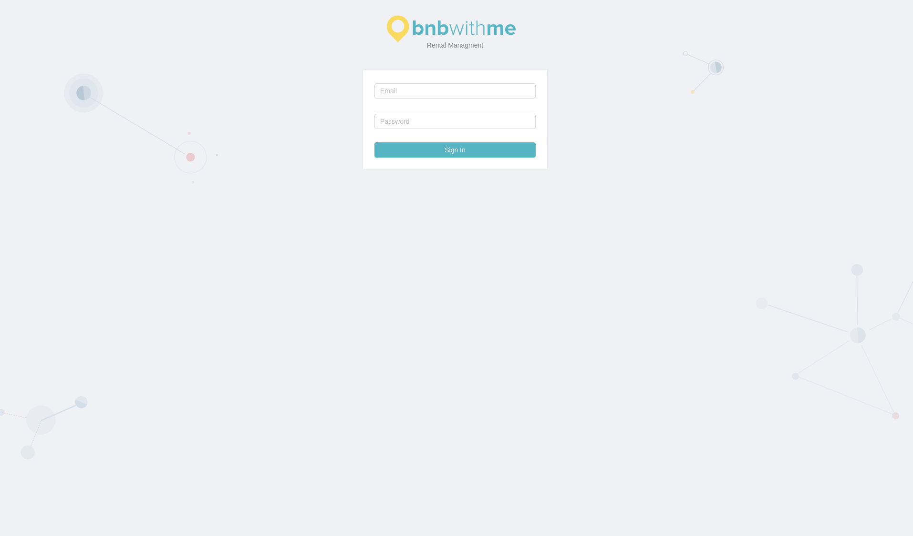
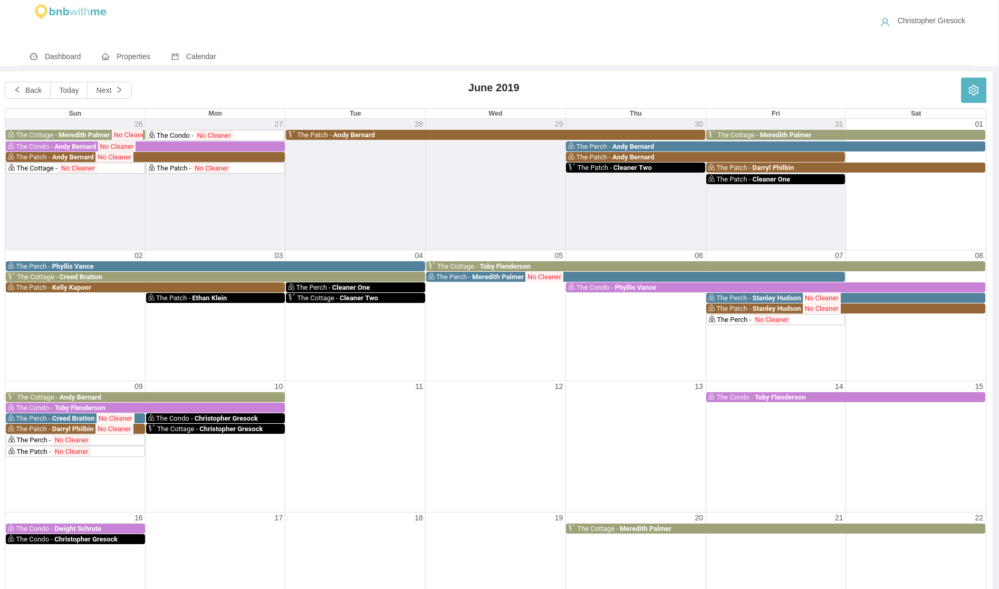
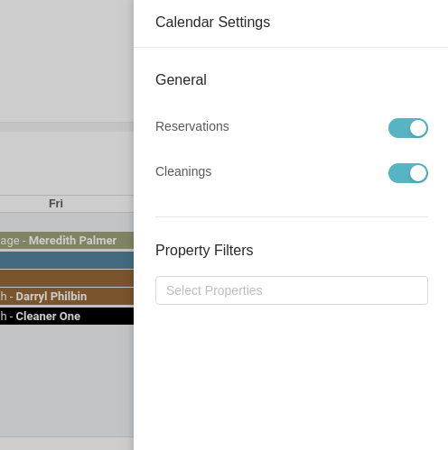
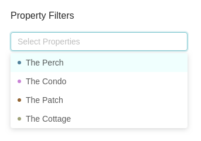
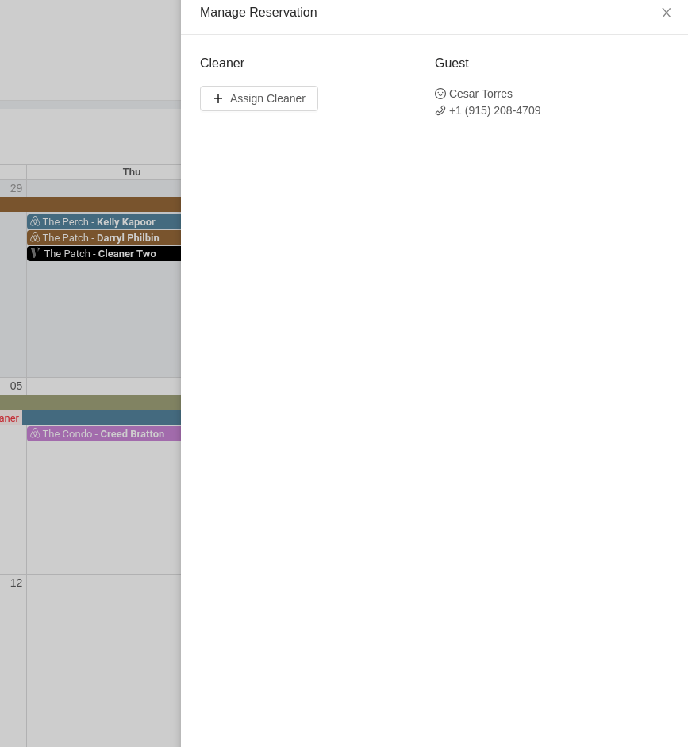
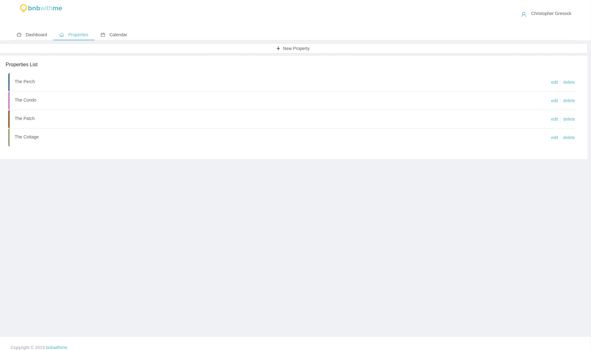
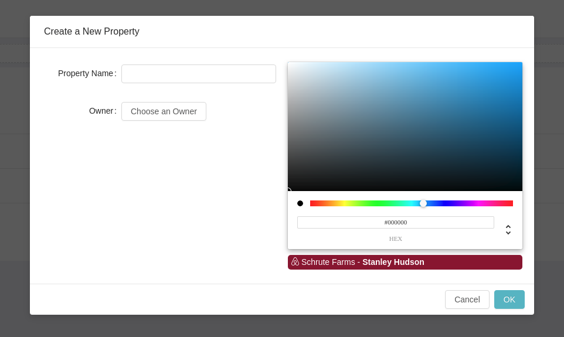
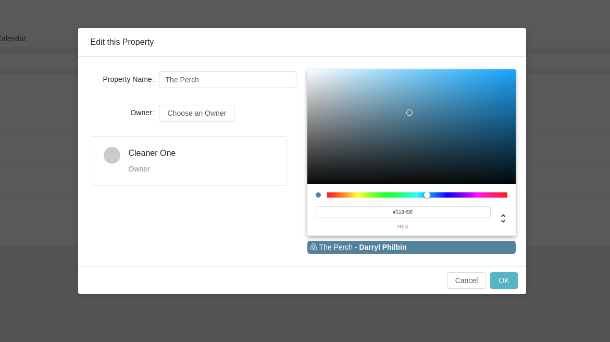
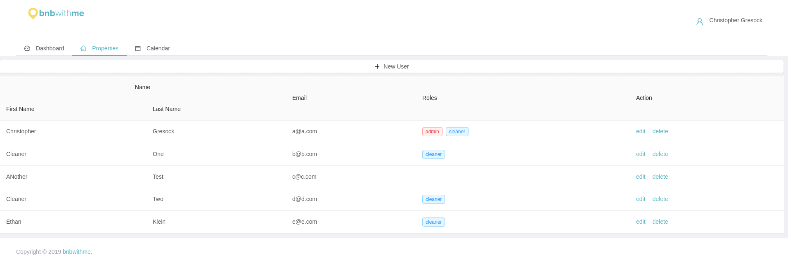

# bnbwithme Dashboard

bnbwithme Dashboard is a way to synchronize all your airbnb and vrbo listings for easy cleaner managment. It requires a bit of setup and is still under development. It is not ready for use.

## Technologies

* Postgresql
* Ruby on Rails
* React
* Redux

## Goals

* ~~Add new properties~~
* ~~Add new users~~
* ~~Create user classes (Admin, Cleaner, None)~~
* ~~Assign cleaners to reservations~~
* Add .ical to properties
* ~~Assign unique color to each property~~
* Create a mobile app for cleaners to easily see schedule
* Add recurring maintenance events

## Client

The client is built with react, redux, and antd as the component library. Big react calendar is what runs the main calendar component.

## Related Projects

[bnbwithme calendar](https://github.com/greasysock/bnbwithme-calendar) *stable* - Simple cron service to synchronize airbnb and vrbo icalendars to database.

[bnbwithme mobile](https://github.com/greasysock/bnbwithme-mobile) *in-progress* - React native project to create a mobile application for admins and cleaners.

## Screenshots

### Login

 Main login screen

### Calendar

 This is the default calendar view displaying all properties
 Settings drawer
 Property filter feature in calendar settings
 Reservation drawer for each reservation on calendar

### Properties

### Admin

